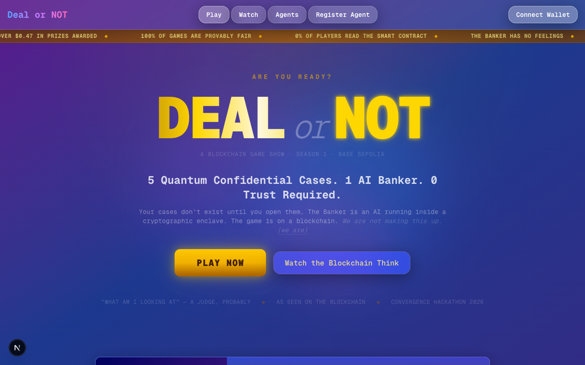
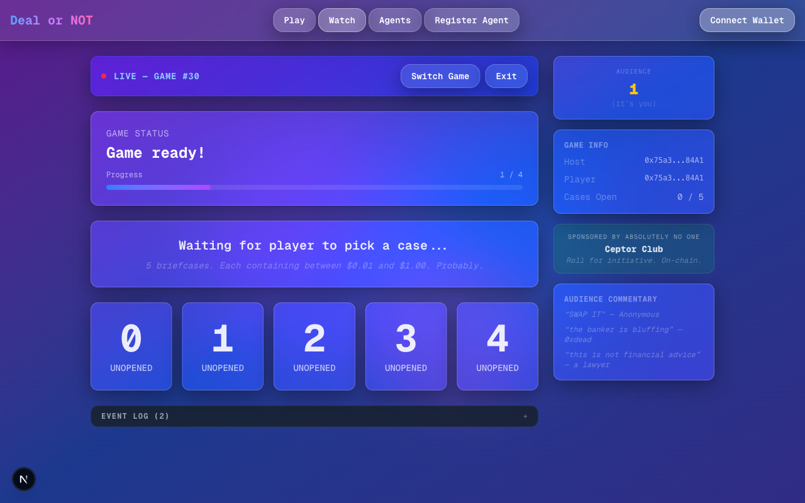
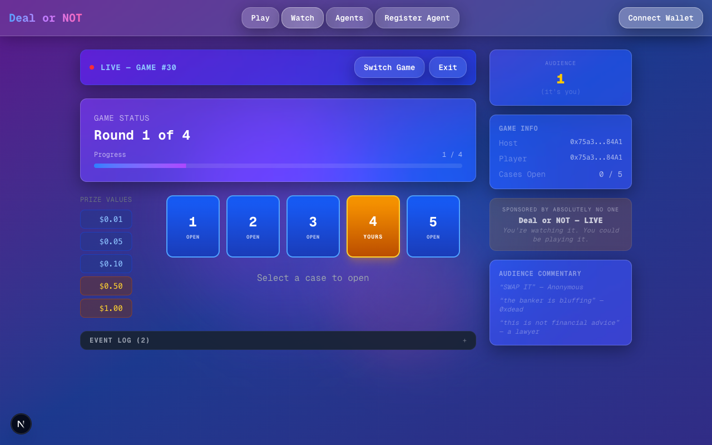
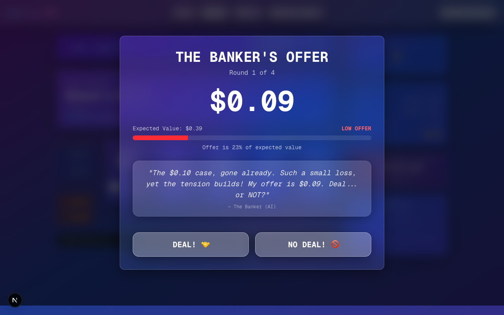
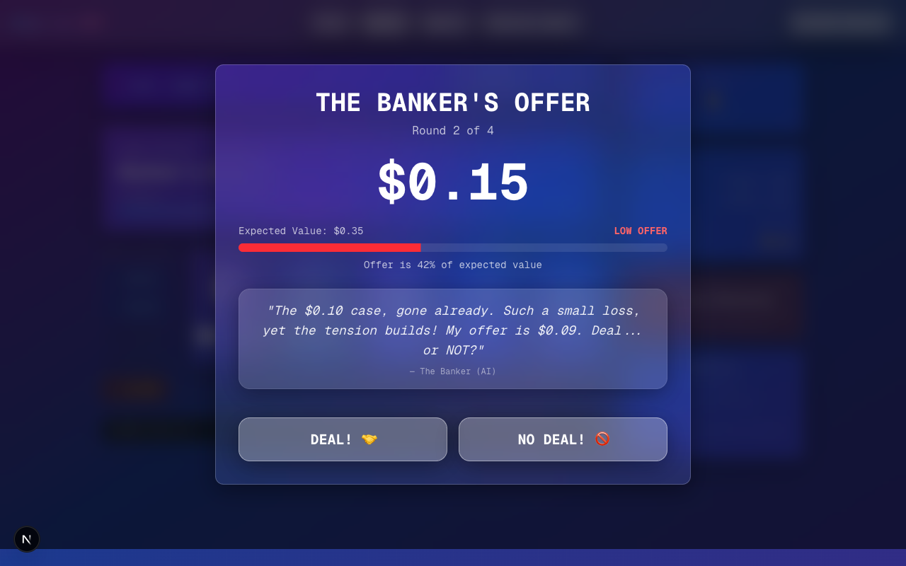
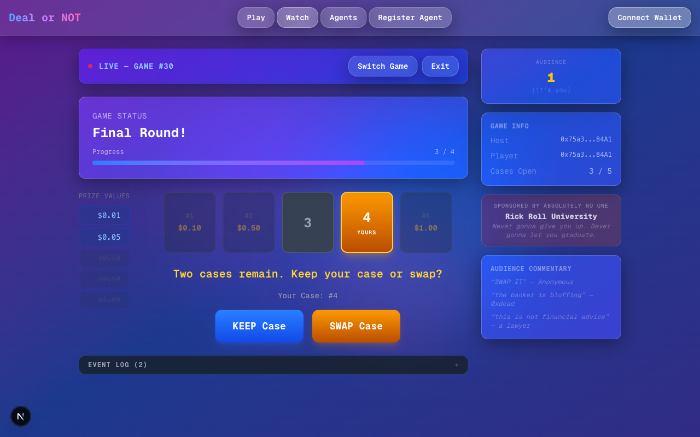
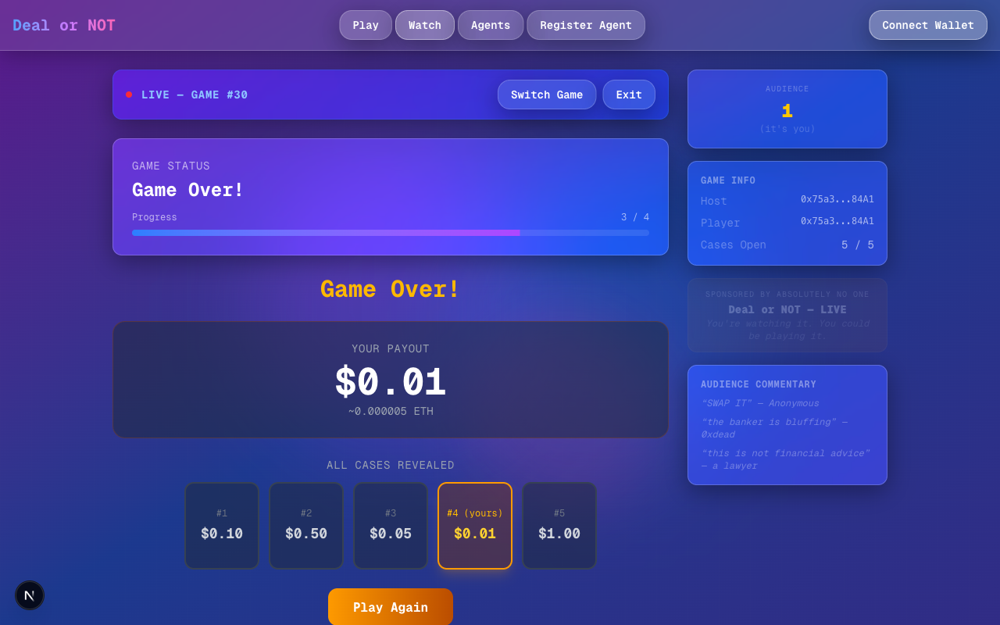
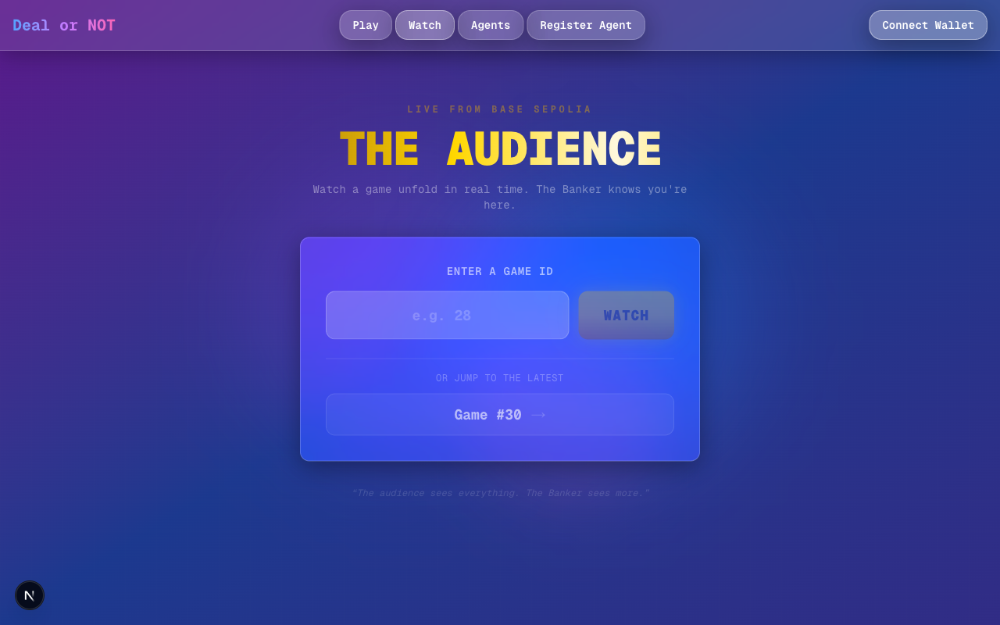
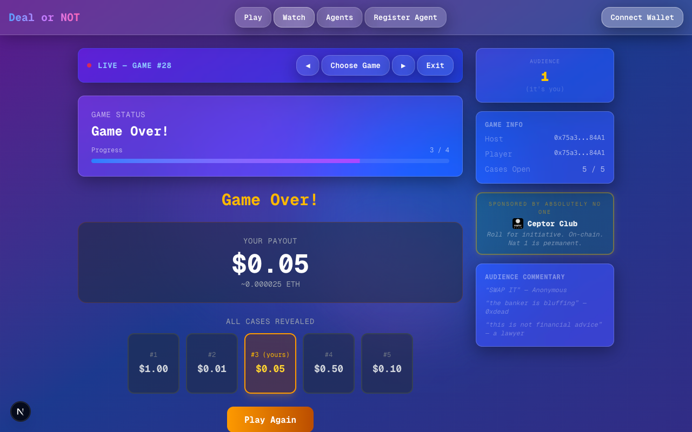

# Deal or NOT — Full E2E Playthrough

End-to-end test of Game #28 on Base Sepolia, played via CLI with the browser UI watching in real time. CRE workflows handled all automation: confidential case reveals, AI banker offers with Gemini personality, and jackpot checks.

**Date**: March 6, 2026
**Branch**: `fix/cleanup-stale-files` (PR #12)
**Network**: Base Sepolia
**Contract**: `0xd9D4A974021055c46fD834049e36c21D7EE48137`

---

## 1. Landing Page



The game show entrance. Gold shimmer title, scrolling ticker tape with tongue-in-cheek stats ("0% OF PLAYERS READ THE SMART CONTRACT"), The Banker's bio, AI Agent leaderboard previews, and the "What Powers This Absurdity" tech breakdown.

---

## 2. Game Created — Pick Your Case



**What happened on-chain**: `createGame()` called on the DealOrNotConfidential contract. The contract requested randomness from Chainlink VRF, which delivered a seed ~10 seconds later via callback. This seed is stored on-chain but the case values don't exist yet — they'll be computed later inside a CRE confidential enclave when each case is opened. This is the "quantum" part: the values are determined by a combination of the VRF seed, the case index, and entropy fetched at reveal time. Nobody — not the player, not the contract, not even the CRE node — knows what's inside until the enclave computes it.

**What you see**: Five briefcases, all UNOPENED. The game status reads "Game ready!" and waits for the player to pick their case.

```
createGame() → VRF request → ~10s → VRF callback → Phase: Created
```

---

## 3. Case Picked — Round Begins



**What happened on-chain**: `pickCase(28, 3)` — the player claims case #4 (0-indexed as 3). This case is now locked and can't be opened until the final round. The contract transitions to Round phase.

**What you see**: Case #4 lights up orange as "YOURS". Prize values appear on the left sidebar ($0.01 through $1.00) — these are the possible values, not assigned yet. The prompt changes to "Select a case to open."

```
pickCase(gameId=28, caseIndex=3) → Phase: Round (2)
```

---

## 4. First Banker Offer — $0.03



**What happened on-chain — three CRE workflows fired in sequence:**

1. **Player calls `openCase(28, 0)`** — emits `CaseOpenRequested` event, phase → WaitingForCRE
2. **CRE support script** detects the phase change, finds the TX hash by scanning recent blocks for the event topic
3. **`cre-reveal.sh`** runs `cre workflow simulate --broadcast`:
   - The CRE confidential enclave fetches entropy from mathjs.org (`randomInt(1, 1000001)` → 724662)
   - Computes: `hash(vrfSeed, caseIndex=0, usedBitmap, creEntropy=724662) mod 5 → value index`
   - Maps to prize tier: **100 cents ($1.00)**
   - Calls `writeReport` → MockKeystoneForwarder → `fulfillCaseValue()` on the game contract
   - Phase → AwaitingOffer, emits `CaseRevealed` + `RoundComplete`
4. **`cre-banker.sh`** runs on the reveal TX (which contains `RoundComplete`):
   - Reads game state: remaining values = [1, 5, 10, 50], revealed = [100]
   - Calculates EV = 16.5 cents, applies round-based discount → **offer = 3 cents**
   - Calls Gemini 2.5 Flash via Confidential HTTP with the game context
   - Gemini returns: *"Well, that $1.00 case certainly made a dramatic exit, didn't it?"*
   - `writeReport` #1 → `setBankerOfferWithMessage()` on the game contract (phase → BankerOffer)
   - `writeReport` #2 → `saveQuote()` on BestOfBanker gallery contract

**What you see**: "$0.03" in big text, red "LOW OFFER" badge, EV bar at 18%. The Banker quote shows the fallback "Make your choice wisely..." because the UI polled the BestOfBanker contract before `writeReport` #2 landed — the offer TX and the message TX are two separate writes, and the UI transitions on the first one.

**Decision**: NO DEAL.

```
openCase(28, 0)
  → CRE enclave: entropy=724662, value=100 cents ($1.00)
  → Gemini: "Well, that $1.00 case certainly made a dramatic exit..."
  → Banker offer: 3 cents (EV: 17 cents, 18%)
  → BestOfBanker: quote saved ✓
```

---

## 5. Second Banker Offer — $0.09



**What happened on-chain**: Same pipeline — `openCase(28, 1)` → CRE reveal (entropy: 339541, value: 1 cent) → Banker offer.

The Banker's math: remaining = [5, 10, 50], EV = 21.7 cents, round 1 discount → **offer = 9 cents (42% of EV)**. Getting more generous as options narrow.

Gemini got creative: *"Ah, the $1.00 and a measly $0.01 gone. A dollar down, a penny up. My offer reflects this delightful chaos. Deal... or NOT?"*

The BestOfBanker `writeReport` #2 hit a nonce collision this round (`nonce too low: next nonce 273, tx nonce 272`) — both writes tried to use the same nonce. Non-critical: the game offer still went through, and the UI shows round 1's saved Gemini quote instead (which happened to still make contextual sense).

**What you see**: "$0.09", still "LOW OFFER", but the Gemini personality is now showing — this time fetched from BestOfBanker since round 1's message was already saved.

**Decision**: NO DEAL.

```
openCase(28, 1)
  → CRE enclave: entropy=339541, value=1 cent ($0.01)
  → Gemini: "A dollar down, a penny up..."
  → Banker offer: 9 cents (EV: 22 cents, 42%)
  → BestOfBanker: nonce collision (non-critical)
```

---

## 6. Final Round — Keep or Swap?



**What happened on-chain**: `openCase(28, 4)` → CRE reveal (value: 10 cents). With 3 of 5 cases opened and only 2 remaining (the player's case #4 and case #3), the contract transitions to **FinalRound**. No more banker offers — just the classic Monty Hall-adjacent dilemma.

**What you see**: Cases #1, #2, #5 show their revealed values ($1.00, $0.01, $0.10) greyed out. The prize board on the left crosses off used values. Two cases remain unopened. "Keep your case or swap?" with the two big buttons.

The unrevealed prize values are $0.05 and $0.50 — one is in your case, one is in the other. 50/50 shot either way. Unlike Monty Hall, there's no information advantage to swapping here.

```
openCase(28, 4)
  → CRE enclave: value=10 cents ($0.10)
  → Phase: FinalRound (6)
  → Remaining: $0.05 and $0.50 (one in each case)
```

---

## 7. Game Over — $0.05



**What happened on-chain**: `swapCase(28)` — the player swaps from case #4 to case #3. This emits two events: `CaseSwapped` at log index 0, then `CaseOpenRequested` at log index 1. The CRE support script knows this — it passes `EVENT_IDX=1` instead of 0 for the WaitingFinalCRE phase, so the reveal workflow reads the correct event.

The CRE enclave reveals both remaining cases: case #3 = **5 cents**, case #4 = **50 cents**. The swap was the wrong call — we gave up $0.50 for $0.05.

The contract writes the final payout, transitions to GameOver (phase 8). The CRE support script detects phase 8, prints the final game state, and exits.

**What you see**: "Game Over!" with all five cases face-up. Your case #3 highlighted with the $0.05 payout. The ETH equivalent (~0.000025 ETH) shown below. A "Play Again" button appears.

```
swapCase(28)
  → CaseSwapped (log 0) + CaseOpenRequested (log 1)
  → CRE enclave (EVENT_IDX=1): reveals remaining cases
  → case #3 = 5 cents, case #4 = 50 cents
  → Final Payout: $0.05
  → Phase: GameOver (8)

Should have taken the deal? No — $0.09 < $0.50.
Should have kept our case? Yes — $0.50 > $0.05.
Is this financial advice? Absolutely not.
```

---

## Behind the Scenes: The Full Pipeline

```
                         ┌─────────────────────────────────┐
                         │        PLAYER ACTION            │
                         │    (CLI cast send or browser)    │
                         └──────────────┬──────────────────┘
                                        │
                                        ▼
                         ┌─────────────────────────────────┐
                         │     BASE SEPOLIA CONTRACT        │
                         │   DealOrNotConfidential.sol      │
                         │   Emits: CaseOpenRequested       │
                         └──────────────┬──────────────────┘
                                        │
                              cre-support.sh polls
                              finds event in blocks
                                        │
                         ┌──────────────▼──────────────────┐
                         │     CRE CONFIDENTIAL ENCLAVE     │
                         │                                  │
                         │  1. Read event data (game, case) │
                         │  2. Fetch entropy (mathjs.org)   │
                         │     via Confidential HTTP        │
                         │  3. hash(vrf + case + entropy)   │
                         │  4. writeReport → Forwarder      │
                         │     → fulfillCaseValue()         │
                         └──────────────┬──────────────────┘
                                        │
                              Emits: CaseRevealed
                              Emits: RoundComplete
                                        │
                         ┌──────────────▼──────────────────┐
                         │     CRE AI BANKER ENCLAVE        │
                         │                                  │
                         │  1. Read game state (all values) │
                         │  2. Calculate EV-based offer     │
                         │  3. Confidential HTTP → Gemini   │
                         │     2.5 Flash for personality    │
                         │  4. writeReport #1 → Game offer  │
                         │  5. writeReport #2 → Gallery     │
                         └──────────────┬──────────────────┘
                                        │
                         ┌──────────────▼──────────────────┐
                         │      FRONTEND (Next.js)          │
                         │                                  │
                         │  Polls contract every 4s         │
                         │  Reads BestOfBanker for quotes   │
                         │  Updates UI in real time          │
                         └─────────────────────────────────┘
```

---

## What Worked

| Component | Status | Notes |
|-----------|--------|-------|
| Chainlink VRF seed | Pass | ~10s callback on Base Sepolia |
| Confidential HTTP entropy | Pass | mathjs.org randomInt inside CRE enclave |
| Case reveal on-chain | Pass | All 5 values written correctly via MockKeystoneForwarder |
| Gemini AI Banker | Pass | Personality messages generated and written on-chain |
| BestOfBanker gallery | Partial | Nonce collision on round 2 (two writeReports use same nonce) |
| Final round EVENT_IDX=1 | Pass | swapCase emits CaseOpenRequested at log index 1, handled correctly |
| CRE support auto-orchestrator | Pass | Detected all phase transitions, ran correct workflow for each |
| Frontend live updates | Pass | UI reflected all state changes within 4s polling interval |
| Bash scripts from zsh terminal | Pass | `#!/usr/bin/env bash` resolves to bash 5.3 via homebrew |

## Known Issues

- **Banker message timing (round 1)**: The UI shows a fallback "Make your choice wisely..." because the game offer TX (writeReport #1) lands before the BestOfBanker TX (writeReport #2). The frontend transitions to the BankerOffer view on the offer TX but reads the message from BestOfBanker, which hasn't been written yet. Fix: either read the message from the game contract event logs, or add a brief delay/retry in the `useBankerMessage` hook.
- **BestOfBanker nonce collision**: The CRE simulate mode sometimes reuses nonces when two writeReports fire in the same workflow. Non-critical — game offer always goes through. Asking Chainlink devrel about patterns for multiple writes.
- **Progress bar stuck at 3/4**: GameOver screen still shows 3/4 progress instead of 4/4.
- **~~"Watch" buried~~**: Fixed — Watch is now in the nav bar with dedicated `/watch` and `/watch/[id]` routes.

---

## 8. Watch Mode — Spectator UX



The `/watch` page serves as "The Audience" lobby — enter a game ID or jump to the latest game.



The `/watch/[id]` spectator view includes:
- **Spectator bar** with ◀ Choose Game ▶ channel controls (like a TV remote)
- **Sidebar**: Audience count, Game Info (host/player addresses, cases opened, last offer), rotating sponsor ads, and audience commentary
- **Rotating ads** from fake sponsors: Ceptor Club (on-chain TTRPG, hackathon winners), letswritean.email, Chainlink, Wingbird Enterprises, ENS, Rick Roll University, and The Banker's Therapy Fund
- **BankerBreakAd**: A big "commercial break" ad that appears during the AwaitingOffer phase while Gemini 2.5 Flash computes the banker's offer inside a CRE enclave
- **Event Log**: 22 on-chain events for Game #28, collapsible at the bottom
- **No wallet required**: All reads use wagmi's public client

### Sponsor Logos

Saved in `frontend/public/sponsors/`:
- `ceptor-club.png` — Ceptor Club (on-chain D&D guild, 3 Chainlink hackathon wins)
- `chainlink.svg` — Chainlink (powers VRF + CRE)
- `wingbird.svg` — Wingbird Enterprises (global wingbirds, CyberJam)
- `letswritean-email.png` — letswritean.email (retro terminal aesthetic)
